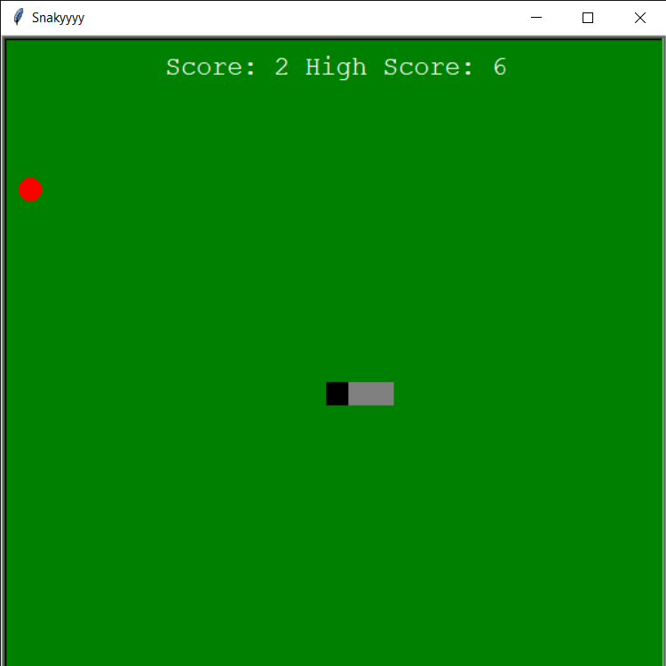

# Snake

Snake Game made with the Turtle Module in Python3

- Border checking
- Sprite Consumption
- Gets slow with time as there is no way to delete sprites in turtle

### Working



### Installation

To run

```sh
$ git clone https://github.com/AnimeshRy/Snake-Python
$ python3 snake.py
```
